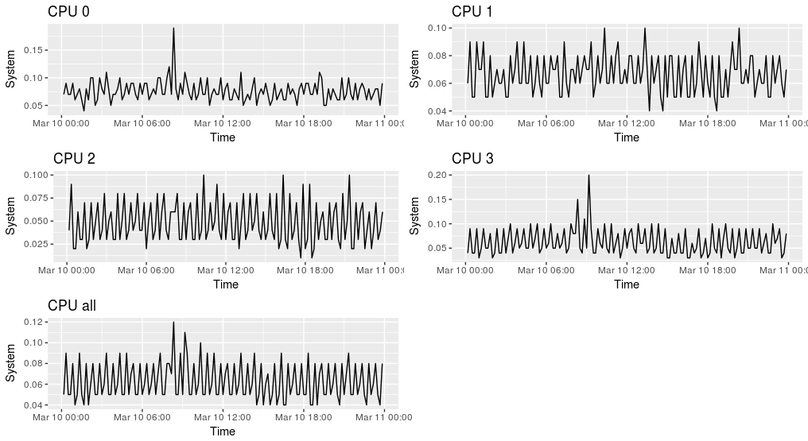

```{r setup, include=FALSE}
knitr::opts_chunk$set(echo = TRUE)
```

## README
### Graphing SAR output
* Demonstrates data import, plotting
	+ report_sar.R	- Example of graphing sar output
	
* As above, except graph memory 
        + sar_memory.R  - Graph memory
	

### Querying RVTools data for VMWare reporting
* Demonstrates data import, plotting, RMarkdown
	+ make_rvtools_example.Rmd
	+ rvtools_example.Rmd
	
	
### Summarizing AWS Data
* Demonstrates reading JSON, output to Excel
  + summarizing_aws_data.Rmd
  
### Build Rstudio Server in a CentOS 7 VirtualBox
Login with rstudent

Use "mkpasswd --method=SHA-512" to generate a new hash
  Vagrantfile
  playbook.yml

### PDFs
PDFs of various lectures/demos for this content

* InstallingCausalImpact - Notes on Google's Causal Impact library
* ParetoChart - 80/20 analysis of help desk tickets
* R_for_Sysdmins_Slides - User group presentation
* wordcloud - Misc reporting 
* WorkingWithSysstat - Sar/Sysstat

### RVest examples


